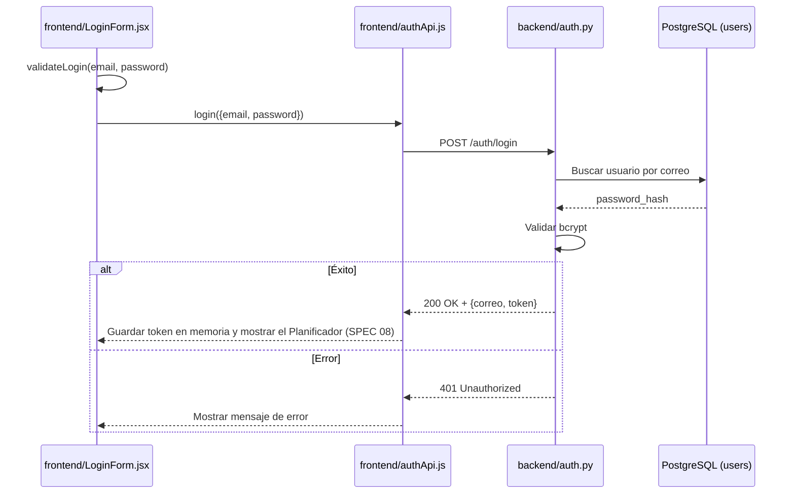

# Especificación Técnica orientada a IA: Sistema de Login

## 1. Metadatos y Tech Stack

**Objetivo:** Autenticar con correo y contraseña contra PostgreSQL y emitir un JWT que el frontend usa en las demás funcionalidades. Incluye tema dark/light.

**Backend Stack:** Python 3.11, FastAPI 0.115.6, SQLAlchemy 2.0.36 + asyncpg, PostgreSQL 16, passlib[bcrypt] 1.7.4, python-jose 3.3.0, Pydantic 2.10.4, pytest 8.3.4. (Contenedor `backend`).

**Frontend Stack:** React 18.3.1, JavaScript (JSX), Vite 5.4, TailwindCSS 3.4, Fetch API (sin axios), Vitest 2.1.9. (Contenedor `frontend`).

## 2. Archivos Involucrados (Rutas / Paths)

El Agente tiene permitido leer y modificar ÚNICAMENTE los siguientes archivos:

**Backend:**
- [EDITAR] `backend/app/api/auth.py` (Router `POST /auth/login`, sin lógica de negocio).
- [EDITAR] `backend/app/models/schemas.py` (`LoginRequest` / `LoginResponse`).
- [EDITAR] `backend/app/services/auth_service.py` (Busca el usuario, verifica bcrypt, emite el JWT).
- [EDITAR] `backend/app/core/security.py` (Hashing y JWT).
- [NUEVO] `backend/tests/test_auth_endpoint.py` (Tests de integración).

**Frontend:**
- [EDITAR] `frontend/src/api/authApi.js` (Llamada fetch + `AuthError`).
- [EDITAR] `frontend/src/hooks/useLogin.js` (Estado, sesión, submit, logout).
- [EDITAR] `frontend/src/validation/validateLogin.js` (Validaciones).
- [EDITAR] `frontend/src/components/LoginForm.jsx` (UI del formulario).
- [EDITAR] `frontend/src/hooks/useTheme.js`, `frontend/src/components/ThemeToggle.jsx`, `frontend/src/index.css` (Tema).

## 3. Flujo del Sistema



## 4. Reglas de Negocio (Business Logic)

**Validación Frontend:**
- Ambos campos son obligatorios: `El correo es obligatorio.` / `La contraseña es obligatoria.`
- El correo no puede tener espacios: `El correo no debe contener espacios en blanco.`
- El formato del correo es inválido: `Ingresá un correo válido.`
- Si hay errores, no se llama al backend.
- El botón dice `Iniciar sesión` y, mientras carga, `Iniciando sesión…` deshabilitado.

**Validación Backend:** Si falta `correo` o `password`, o si el correo tiene espacios, devolver 422.

**Seguridad Backend:**
- El correo se normaliza con `strip().lower()`.
- La contraseña se compara con bcrypt.
- Nunca se devuelve `password_hash`.
- Se usa el mismo mensaje para correo inexistente y contraseña incorrecta.

**Token:**
- JWT firmado con `JWT_SECRET` (variable de entorno), algoritmo HS256.
- Expiración: `JWT_EXPIRE_MINUTES` (60 min).
- El frontend lo guarda **solo en memoria**, no en localStorage.

**Errores en la UI** (nunca se muestra el mensaje crudo del backend):

| Caso | Mensaje |
|---|---|
| Error de red | `No se pudo conectar con el servidor.` |
| 400 / 401 | `Correo o contraseña incorrectos.` |
| Otro error | `No se pudo iniciar sesión. Intentá de nuevo.` |

**Tema dark/light:**
- Sin librerías: solo variables CSS en `index.css` y el atributo `data-theme` en `<html>`.
- La preferencia se guarda en `localStorage["practica-1:theme"]`.
- Si no hay preferencia guardada, se usa `prefers-color-scheme`.

## 5. El Contrato (API Contract)

El Agente debe respetar estrictamente esta estructura para la comunicación.

**Ruta:** `POST /auth/login`
**Content-Type:** `application/json`

**Request** (Enviado por `authApi.js`)

```json
{
  "correo": "admin@practica.com",
  "password": "admin123"
}
```

**Response HTTP 200** (Éxito)

```json
{
  "correo": "admin@practica.com",
  "token": "eyJhbGciOiJIUzI1Ni...",
  "token_type": "bearer"
}
```

**Response HTTP 401** (Credenciales incorrectas)

```json
{
  "detail": "Correo o contraseña incorrectos."
}
```

**Response HTTP 422** (Body inválido, formato estándar de FastAPI)

```json
{
  "detail": [{ "loc": ["body", "correo"], "msg": "Value error, El correo no debe contener espacios en blanco." }]
}
```

## 6. Instrucciones de Ejecución para el Agente (Criterios)

1. **`dev-backend`:** Mantener `auth.py` y `auth_service.py` cumpliendo el Contrato.
2. **`frontend`:** `authApi.js` envía `{correo, password}` y lee `{correo, token}`.
3. **`frontend`:** `LoginForm.jsx` usa Tailwind. Los errores de cada campo van debajo del input y el error general va en `role="alert"`.
4. **`qa`:** Crear `test_auth_endpoint.py` con los casos 200, 401 (correo inexistente y contraseña incorrecta) y 422.

**Criterios de aceptación:**
- ✅ Un login correcto permite acceder al Planificador de Visitas.
- ✅ Una contraseña incorrecta rechaza el acceso con `Correo o contraseña incorrectos.`
- ✅ Los campos vacíos muestran el error sin llamar al backend.
- ✅ El tema dark/light se mantiene tras recargar la página.
