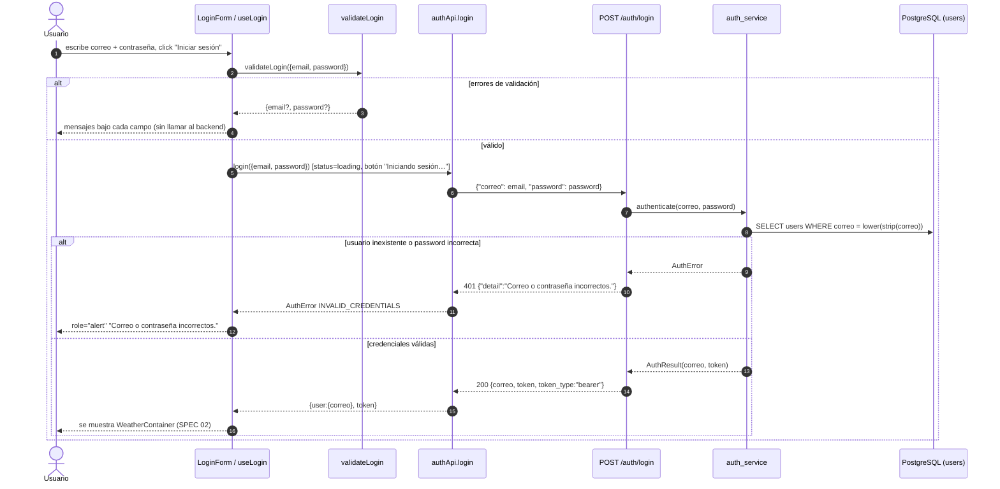

# SPEC 01 — Login (autenticación con JWT) + Tema dark/light

> **Estado:** Implementado · **Versión del spec:** 2.0 · **Agentes:** `dev-backend`, `frontend`, `qa`, `devops`

---

## 1. Metadatos y Tech Stack

| Capa | Tecnología | Versión exacta |
|---|---|---|
| Backend runtime | Python (imagen `python:3.11-slim`) | 3.11 |
| Framework API | fastapi | 0.115.6 |
| Servidor ASGI | uvicorn[standard] | 0.34.0 |
| ORM | SQLAlchemy (async) | 2.0.36 |
| Driver DB | asyncpg | 0.30.0 |
| Hashing | passlib[bcrypt] / bcrypt | 1.7.4 / 4.0.1 |
| JWT | python-jose[cryptography] | 3.3.0 |
| Validación | pydantic[email] / pydantic-settings | 2.10.4 / 2.7.1 |
| Tests backend | pytest / pytest-asyncio / pytest-cov | 8.3.4 / 0.25.2 / 6.0.0 |
| Base de datos | PostgreSQL (imagen `postgres:16-alpine`) | 16 |
| Frontend | react / react-dom | 18.3.1 |
| Bundler | vite / @vitejs/plugin-react | 5.4.x / 4.x |
| Estilos | tailwindcss / postcss / autoprefixer | 3.4.x / 8.x / 10.x |
| Tests frontend | vitest / jsdom / @testing-library/react | 2.1.9 / 25.0.1 / 16.x |
| HTTP cliente | `fetch` nativo (**sin axios**) | — |
| Build/serve front | `node:20-alpine` → `nginx:alpine` | 20 / latest |

**Restricciones técnicas:**
- Sin librerías de routing, de estado global ni de temas. El tema se hace con CSS propio (variables + `data-theme`).
- La contraseña viaja en claro sobre el canal. **No** se hashea en el cliente. TLS le corresponde a `devops`; en local se usa HTTP plano.
- `JWT_SECRET` sale siempre de una variable de entorno, nunca del código.

---

## 2. Árbol de Archivos Involucrados (Paths)

```text
backend/
├── app/main.py                     # [LEER]  registra routers, CORS, create_all en lifespan
├── app/api/auth.py                 # [EDITAR] router POST /auth/login (sin lógica)
├── app/models/schemas.py           # [EDITAR] LoginRequest / LoginResponse (Pydantic)
├── app/services/auth_service.py    # [EDITAR] authenticate(): normaliza, busca, verifica, emite JWT
├── app/core/security.py            # [EDITAR] hash_password, verify_password, create_access_token, decode
├── app/core/exceptions.py          # [LEER]  AuthError
├── app/core/config.py              # [LEER]  Settings (JWT_*, DATABASE_URL, CORS_ORIGINS)
├── app/db/models.py                # [LEER]  modelo User
├── app/db/users.py                 # [LEER]  get_user_by_correo
├── app/db/session.py               # [LEER]  engine async + get_session
├── seed.py                         # [LEER]  usuarios de prueba idempotentes
└── tests/test_auth_endpoint.py     # [CREAR] (no existe aún, ver §7)
db/init.sql                         # [LEER]  tabla users + seed SQL

frontend/
├── src/App.jsx                     # [LEER]  layout + useTheme + ThemeToggle + LoginContainer
├── src/api/authApi.js              # [EDITAR] login({email,password}) + AuthError
├── src/hooks/useLogin.js           # [EDITAR] estado del form, sesión, submit, logout, expireSession
├── src/validation/validateLogin.js # [EDITAR] validateLogin / hasErrors
├── src/components/LoginContainer.jsx # [EDITAR] container: LoginForm ↔ WeatherContainer
├── src/components/LoginForm.jsx    # [EDITAR] presentacional
├── src/hooks/useTheme.js           # [EDITAR] preferencia de tema + localStorage + data-theme
├── src/components/ThemeToggle.jsx  # [EDITAR] botón de tema (presentacional)
├── src/index.css                   # [EDITAR] variables CSS por tema
├── tailwind.config.js              # [LEER]  colores → var(--color-*)
└── tests/
    ├── validateLogin.test.js       # [EXISTE]
    ├── LoginForm.test.jsx          # [EXISTE]
    ├── LoginContainer.test.jsx     # [EXISTE]
    ├── errorMapping.test.jsx       # [EXISTE]
    └── useTheme.test.jsx           # [CREAR] (no existe aún, ver §7)
```

---

## 3. Contexto Breve

Un usuario registrado ingresa correo y contraseña. El backend los verifica contra un hash bcrypt en PostgreSQL y emite un JWT (HS256) que el frontend guarda **solo en memoria** (estado React) para autenticar las llamadas siguientes, por ejemplo la del SPEC 02. La UI permite alternar el tema claro/oscuro sin librerías.

---

## 4. Flujo (Secuencia)



---

## 5. Reglas de Negocio Estrictas

**Validación en el frontend** (`validateLogin.js`, se reporta el primer error por campo, en este orden):
1. Correo vacío o solo espacios → `El correo es obligatorio.`
2. Correo con cualquier espacio (`/\s/`) → `El correo no debe contener espacios en blanco.`
3. Correo que no cumple `/^[^\s@]+@[^\s@]+\.[^\s@]+$/` → `Ingresá un correo válido.`
4. Contraseña `''` → `La contraseña es obligatoria.`
5. Si hay errores, **no** se llama al backend. Al editar un campo se borra su error y el `formError`.

**Backend:**
6. `correo`: `EmailStr` obligatorio. Si contiene espacios → 422 con `El correo no debe contener espacios en blanco.`
7. `password`: obligatorio, `min_length=1`. Si queda vacío tras strip → 422 con `La contraseña es obligatoria.`
8. El correo se normaliza con `strip().lower()` antes de buscarlo.
9. La contraseña se verifica con bcrypt (passlib `CryptContext(schemes=["bcrypt"])`). Un hash con formato inválido cuenta como contraseña incorrecta.
10. **Mensaje genérico:** si el correo no existe o la contraseña es incorrecta se responde exactamente lo mismo: `401 Correo o contraseña incorrectos.`
11. Nunca se devuelve `password_hash` ni se loggea la contraseña o el hash.
12. JWT: `HS256` (`JWT_ALGORITHM`), expira en `JWT_EXPIRE_MINUTES` (default 60), claims `{sub, correo, iat, exp}`.

**Sesión y UI:**
13. El token vive solo en estado React (`useLogin.session`). **No** se persiste en localStorage ni en sessionStorage: al recargar hay que volver a iniciar sesión.
14. "Cerrar sesión" es local: limpia el estado y no llama al backend.
15. `expireSession(msg)` (invocada ante un 401 del SPEC 02) limpia la sesión y muestra `Tu sesión expiró. Iniciá sesión nuevamente.`
16. Textos fijos: heading `Iniciar sesión`; botón `Iniciar sesión` / `Iniciando sesión…` (U+2026) mientras carga, con el botón y los inputs deshabilitados.
17. Ningún mensaje crudo del backend llega al usuario. Mapeo de `authApi`:

| Situación | Mensaje UI | code |
|---|---|---|
| fetch lanza (red) | `No se pudo conectar con el servidor.` | `NETWORK_ERROR` |
| HTTP 400 o 401 | `Correo o contraseña incorrectos.` | `INVALID_CREDENTIALS` |
| otro `!ok` | `No se pudo iniciar sesión. Intentá de nuevo.` | `SERVER_ERROR` |
| JSON inválido o sin `token`/`correo` | `El servidor devolvió una respuesta inválida.` | `INVALID_RESPONSE` |

**Tema dark/light:**
18. No se usan librerías ni `darkMode` de Tailwind. Solo variables CSS en `index.css` y colores de Tailwind mapeados a `var(--color-*)`.
19. La preferencia se guarda en `localStorage["practica-1:theme"]` con valor `light` o `dark`. Cualquier otro valor equivale a `null` (seguir al sistema). Todo acceso a storage va en try/catch.
20. Tema efectivo = preferencia ?? `prefers-color-scheme`. Se aplica con `data-theme` en `<html>`, que se quita si la preferencia es `null`.
21. `ThemeToggle`: `aria-label` es `Activar tema claro` (si el tema es oscuro) o `Activar tema oscuro` (si es claro); el texto visible es `Tema: oscuro` / `Tema: claro`.

---

## 6. Contrato API

> Frontera de red entre `frontend` y `backend`. **Inmutable:** cualquier cambio exige actualizar primero este spec.
> Base URL: `VITE_API_URL` (default `http://localhost:8000`). Se embebe en el build y **no** hay proxy `/api` en nginx.

```yaml
openapi: 3.1.0
info:
  title: Practica - Auth API
  version: 1.0.0
servers:
  - url: http://localhost:8000
paths:
  /auth/login:
    post:
      tags: [auth]
      summary: Autentica un usuario y emite un JWT
      requestBody:
        required: true
        content:
          application/json:
            schema:
              $ref: '#/components/schemas/LoginRequest'
            example:
              correo: admin@practica.com
              password: admin123
      responses:
        '200':
          description: Credenciales válidas
          content:
            application/json:
              schema:
                $ref: '#/components/schemas/LoginResponse'
              example:
                correo: admin@practica.com
                token: eyJhbGciOiJIUzI1NiIsInR5cCI6IkpXVCJ9...
                token_type: bearer
        '401':
          description: Correo o contraseña incorrectos (mismo mensaje en ambos casos)
          content:
            application/json:
              schema:
                $ref: '#/components/schemas/ErrorDetail'
              example:
                detail: Correo o contraseña incorrectos.
        '422':
          description: Body inválido (formato estándar Pydantic v2)
          content:
            application/json:
              schema:
                $ref: '#/components/schemas/ValidationError'
              example:
                detail:
                  - type: value_error
                    loc: [body, correo]
                    msg: Value error, El correo no debe contener espacios en blanco.
                    input: "a @b.com"
  /health:
    get:
      tags: [health]
      summary: Liveness del backend (no consulta la DB)
      responses:
        '200':
          description: OK
          content:
            application/json:
              example:
                status: ok
components:
  schemas:
    LoginRequest:
      type: object
      required: [correo, password]
      properties:
        correo:
          type: string
          format: email
          description: Sin espacios en blanco. El backend lo normaliza con strip().lower().
        password:
          type: string
          minLength: 1
          description: No puede quedar vacío tras strip. Se envía en claro, sin hashear.
    LoginResponse:
      type: object
      required: [correo, token, token_type]
      properties:
        correo:
          type: string
          format: email
          description: Correo tal como está guardado en la DB (minúsculas)
        token:
          type: string
          description: "JWT HS256. Claims: sub, correo, iat, exp"
        token_type:
          type: string
          const: bearer
    ErrorDetail:
      type: object
      required: [detail]
      properties:
        detail:
          type: string
    ValidationError:
      type: object
      properties:
        detail:
          type: array
          items:
            type: object
            properties:
              type: { type: string }
              loc: { type: array, items: { oneOf: [ { type: string }, { type: integer } ] } }
              msg: { type: string }
              input: {}
```

**Modelo de datos (referencia, no forma parte del contrato de red):**

| Columna `users` | Tipo | Restricción |
|---|---|---|
| id | BIGSERIAL | PK |
| correo | VARCHAR(255) | NOT NULL, UNIQUE, índice `ix_users_correo` |
| password_hash | VARCHAR(255) | NOT NULL (bcrypt) |
| created_at / updated_at | TIMESTAMPTZ | DEFAULT now() |

Usuarios semilla: `admin@practica.com` / `admin123` y `jperez@practica.com` / `Practica-1`.

---

## 7. Instrucciones de Ejecución / Criterios de Aceptación

### Criterios de aceptación (Gherkin)

```gherkin
Escenario: Login correcto
  Dado un usuario registrado "admin@practica.com" con contraseña "admin123"
  Cuando envía el formulario
  Entonces el backend responde 200 con {correo, token, token_type:"bearer"}
  Y la UI muestra el heading "Consulta meteorológica"

Escenario: Contraseña incorrecta o correo inexistente
  Cuando envía credenciales inválidas
  Entonces el backend responde 401 {"detail":"Correo o contraseña incorrectos."}
  Y la UI muestra ese mismo texto en role="alert"

Escenario: Campos vacíos
  Cuando envía el formulario vacío
  Entonces se muestran "El correo es obligatorio." y "La contraseña es obligatoria."
  Y no se realiza ninguna petición HTTP

Escenario: Correo con espacios
  Cuando escribe "a @b.com"
  Entonces se muestra "El correo no debe contener espacios en blanco."

Escenario: Tema persistido
  Cuando pulsa el botón de tema estando en claro
  Entonces <html> tiene data-theme="dark"
  Y localStorage["practica-1:theme"] = "dark"
```

### Checklist

- [x] Validación del front (`validateLogin.test.js`)
- [x] Render y estados de `LoginForm` (`LoginForm.test.jsx`)
- [x] Integración login → clima y 401 → vuelve al login (`LoginContainer.test.jsx`)
- [x] El mensaje crudo del backend no se filtra (`errorMapping.test.jsx`)
- [ ] **Backend:** tests de `POST /auth/login` (200, 401 con correo inexistente, 401 con contraseña incorrecta, 422 con espacios, que no se devuelva `password_hash`)
- [ ] **Frontend:** tests de `useTheme` / `ThemeToggle` (persistencia, `data-theme`, valor inválido en storage)
- [ ] **Frontend:** tests de `NETWORK_ERROR`, `SERVER_ERROR` e `INVALID_RESPONSE` en login, y de `Cerrar sesión`

### Instrucciones para los agentes

| Agente | Tarea |
|---|---|
| `qa` | Crear `backend/tests/test_auth_endpoint.py` y `frontend/tests/useTheme.test.jsx` cubriendo las casillas pendientes. No tocar código de producción: si un test falla, reportar al agente dueño. |
| `dev-backend` | Mantener el contrato del §6. Cualquier cambio de campos o mensajes se actualiza primero en este spec. |
| `frontend` | Mantener el mapeo de errores del §5 (regla 17) y los textos literales. |
| `devops` | No aplica para este spec, salvo añadir TLS fuera de local. |

### Puntos abiertos (decidir antes de cambiar el contrato)
- Un error de DB en el login responde `500` en texto plano ("Internal Server Error"), no JSON.
- python-jose acepta un token firmado sin `exp`. Se podría exigir `options={"require_exp": True}`.
- El front no hace trim ni lowercase del correo (lo hace el backend). Es aceptable porque un correo con espacios se rechaza antes.
- Puede haber un parpadeo de tema al cargar (FOUC): `data-theme` se aplica en un `useEffect` y no en un script inline.
