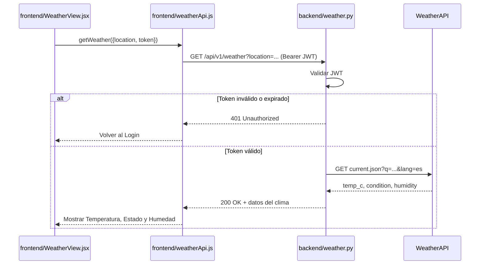

# Especificación Técnica orientada a IA: Consulta Meteorológica

> **Estado:** la UI de Clima se **retiró** en el SPEC 08. Solo sigue vigente la parte **backend** (`GET /api/v1/weather`). Las reglas y los archivos de frontend de este spec son históricos y no se deben implementar.

## 1. Metadatos y Tech Stack

**Objetivo:** Permitir a un usuario autenticado consultar el clima de una ciudad. El backend consulta WeatherAPI, así que la API key nunca llega al navegador.

**Backend Stack:** Python 3.11, FastAPI 0.115.6, httpx 0.28.1, python-jose 3.3.0, Pydantic 2.10.4, pytest 8.3.4. (Contenedor `backend`).

**Frontend Stack:** React 18.3.1, JavaScript (JSX), Vite 5.4, TailwindCSS 3.4, Fetch API, Vitest 2.1.9. (Contenedor `frontend`).

## 2. Archivos Involucrados (Rutas / Paths)

El Agente tiene permitido leer y modificar ÚNICAMENTE los siguientes archivos:

**Backend:**
- [EDITAR] `backend/app/api/weather.py` (Router `GET /api/v1/weather`).
- [EDITAR] `backend/app/api/dependencies.py` (Validación del JWT y de `location`).
- [EDITAR] `backend/app/services/weather_service.py` (Formato de la respuesta).
- [EDITAR] `backend/app/integrations/weather_api.py` (Cliente httpx hacia WeatherAPI).
- [EDITAR] `backend/app/models/weather.py` (`WeatherResponse`).
- [EDITAR] `backend/tests/test_weather_endpoint.py` (Tests).

**Frontend:** [RETIRADO en SPEC 08] `weatherApi.js`, `useWeather.js`, `WeatherView.jsx` y `cities.js` ya no existen.

## 3. Flujo del Sistema



## 4. Reglas de Negocio (Business Logic)

**Validación Frontend:**
- El `<select>` ofrece solo estas ciudades:
  - `Huánuco, Perú`, que envía `Huanuco, Peru`.
  - `Tingo María, Perú`, que envía `Tingo Maria, Peru`.
- El botón `Consultar` queda deshabilitado si no hay ciudad seleccionada o si hay una consulta en curso.
- Mientras carga se muestra `Consultando…`.

**Validación Backend:**
- Se requiere `Authorization: Bearer <JWT>`. Sin token, o con un token inválido o expirado, devuelve 401.
- `location` debe tener entre 1 y 100 caracteres. Si no, devuelve 422.

**Seguridad:**
- `WEATHER_API_KEY` existe solo en el backend, como variable de entorno.
- La key y los errores del proveedor nunca llegan al cliente.

**Formato de la respuesta:**
- `temperature` se envía como `"24°C"`.
- `humidity` se envía como `"60%"`.
- `condition` viene en español (se pide con `lang=es`).

**Errores del proveedor:**

| Caso | Respuesta |
|---|---|
| Ciudad no encontrada | 404 |
| Respuesta inválida | 502 |
| Proveedor caído o timeout (5 s) | 503 |

**Errores en la UI** (muestra un mensaje genérico y un botón `Reintentar`):

| Caso | Mensaje |
|---|---|
| 401 | `Tu sesión expiró. Iniciá sesión nuevamente.` (vuelve al Login) |
| 404 | `No se encontró información para la ciudad seleccionada.` |
| 503 | `El servicio meteorológico no está disponible temporalmente.` |
| Otro | `No se pudo consultar el clima. Intentá de nuevo.` |

## 5. El Contrato (API Contract)

El Agente debe respetar estrictamente esta estructura para la comunicación.

**Ruta:** `GET /api/v1/weather?location={city_name}`
**Headers:** `Authorization: Bearer <token_jwt>`

**Response HTTP 200** (Éxito)

```json
{
  "location": "Huanuco",
  "temperature": "24°C",
  "condition": "Despejado",
  "humidity": "60%"
}
```

**Response HTTP 401** (Sin sesión o token expirado)

```json
{
  "detail": "No autenticado."
}
```

**Response HTTP 404 / 422 / 502 / 503** (Errores)

```json
{
  "detail": "Mensaje de error"
}
```

| Código | `detail` |
|---|---|
| 404 | `No se encontró la ciudad.` |
| 422 | `La ubicación debe contener entre 1 y 100 caracteres y no incluir controles.` |
| 502 | `El proveedor devolvió una respuesta inválida.` |
| 503 | `Servicio meteorológico no disponible.` |

## 6. Instrucciones de Ejecución para el Agente (Criterios)

1. **`dev-backend`:** Mantener `weather.py` y `weather_service.py` cumpliendo el Contrato.
2. **`frontend`:** `weatherApi.js` envía el header `Authorization` y valida que la respuesta traiga los 4 campos.
3. **`frontend`:** `WeatherView.jsx` usa Tailwind. Si la petición falla, muestra el mensaje de la tabla en `role="alert"`.
4. **`qa`:** Cubrir los casos 200, 401, 404 y 503 en el frontend y el backend.

**Criterios de aceptación:**
- ✅ Un usuario logueado que selecciona Huánuco o Tingo María y presiona `Consultar` ve el clima.
- ✅ Sin sesión activa, el sistema bloquea la consulta y vuelve al Login.
- ✅ Ninguna respuesta expone la API key de WeatherAPI.
