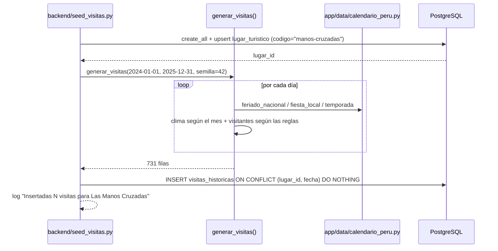

# Especificación Técnica orientada a IA: Datos Históricos de Visitas — Las Manos Cruzadas

## 1. Metadatos y Tech Stack

**Objetivo:** Registrar el lugar turístico **Las Manos Cruzadas** (Templo de Kotosh, Huánuco) y poblar la BD con 2 años de visitas diarias inventadas (2024-01-01 a 2025-12-31). Un script de Python genera los datos y los inserta en PostgreSQL. Los datos deben tener patrones coherentes para el RAG (SPEC 05) y el LLM (SPEC 06).

**Backend Stack:** Python 3.11, SQLAlchemy 2.0.36 (async) + asyncpg 0.30.0, PostgreSQL 16, pytest 8.3.4. (Contenedores `db` y `backend`).

**Frontend Stack:** No aplica.

## 2. Archivos Involucrados (Rutas / Paths)

El Agente tiene permitido leer y modificar ÚNICAMENTE los siguientes archivos:

**Base de datos:**
- [EDITAR] `db/init.sql` (Añadir las tablas `lugar_turistico` y `visitas_historicas`).

**Backend:**
- [NUEVO] `backend/app/data/__init__.py` (Paquete vacío).
- [NUEVO] `backend/app/data/calendario_peru.py` (Feriados, fiestas locales y temporadas. Lo reutiliza el SPEC 04).
- [EDITAR] `backend/app/db/models.py` (Modelos ORM `LugarTuristico` y `VisitaHistorica`).
- [NUEVO] `backend/seed_visitas.py` (Script: crea el lugar, genera las visitas y las inserta en la BD).
- [NUEVO] `backend/tests/test_seed_visitas.py` (Tests del generador).

## 3. Flujo del Sistema



## 4. Reglas de Negocio (Business Logic)

**Lugar turístico:** El sistema trabaja con un solo lugar: `codigo = "manos-cruzadas"`. Los demás specs lo buscan por ese código, nunca por `id` fijo. `horario` y `aforo_maximo` son valores informativos del mock y no limitan los datos.

**Ejecución del script:**
- Con Docker: `docker compose exec backend python seed_visitas.py`.
- En local: `python seed_visitas.py` (con `.env`).
- Llama a `Base.metadata.create_all` antes de insertar, porque `init.sql` solo se ejecuta cuando el volumen de la BD está vacío.

**Calendario** (`calendario_peru.py`, sin dependencias externas):
- Feriados nacionales fijos (MM-DD):
  - 01-01, 05-01, 06-07, 06-29, 07-23, 07-28, 07-29
  - 08-06, 08-30, 10-08, 11-01, 12-08, 12-09, 12-25
- Feriados móviles: Jueves y Viernes Santo, calculados con el algoritmo de Pascua gregoriano.
- Fiestas locales: 06-24 `Fiesta de San Juan` y 08-15 `Aniversario de Huánuco`.
- Temporada `vacacional`: 01-01 a 03-15, 07-22 a 08-10 y 12-20 a 12-31. El resto del año es `escolar`.
- `es_feriado = True` si es feriado nacional **o** fiesta local.

**Clima inventado** (se elige por mes):
- Probabilidad de lluvia: diciembre–marzo 55 %, abril y noviembre 30 %, mayo–octubre 10 %.
- Si llueve: `Lluvia ligera` (70 %) o `Lluvia fuerte` (30 %).
- Si no llueve: `Soleado` (50 %), `Parcialmente nublado` (30 %) o `Nublado` (20 %).
- `temperatura_max`: 22.0–31.0 °C con un decimal; restar 3 °C si llueve.

**Visitantes inventados** = base del día × multiplicadores, redondeado a entero ≥ 0.
- Base: Lunes–Jueves `60–90`, Viernes `90–120`, Sábado `180–260`, Domingo `300–420`.
- Clima: Soleado ×1.10, Parcialmente nublado ×1.00, Nublado ×0.90, Lluvia ligera ×0.70, Lluvia fuerte ×0.45.
- Feriado nacional ×1.40 o fiesta local ×1.60 (se usa el mayor). Temporada vacacional ×1.20.

**Reproducibilidad e idempotencia:** Se usa `random.Random(42)`. Si el script se ejecuta dos veces, no duplica el lugar ni las visitas.

## 5. El Contrato (API Contract)

Contrato interno (no expuesto por HTTP). Los SPEC 04 y 05 leen estas tablas.

**Tablas** (`db/init.sql`)

```sql
CREATE TABLE IF NOT EXISTS lugar_turistico (
    id           BIGSERIAL PRIMARY KEY,
    codigo       VARCHAR(50)  NOT NULL UNIQUE,  -- "manos-cruzadas"
    nombre       VARCHAR(120) NOT NULL,         -- "Las Manos Cruzadas"
    sitio        VARCHAR(120) NOT NULL,         -- "Templo de Kotosh"
    ubicacion    VARCHAR(120) NOT NULL,         -- "Huánuco, Perú"
    horario      VARCHAR(60)  NOT NULL,         -- "08:00-17:00" (mock)
    aforo_maximo INTEGER      NOT NULL          -- 600 (mock)
);
CREATE TABLE IF NOT EXISTS visitas_historicas (
    id                 BIGSERIAL PRIMARY KEY,
    lugar_id           BIGINT       NOT NULL REFERENCES lugar_turistico(id),
    fecha              DATE         NOT NULL,
    dia_semana         VARCHAR(10)  NOT NULL, -- Lunes..Domingo
    condicion_clima    VARCHAR(25)  NOT NULL,
    temperatura_max    NUMERIC(4,1) NOT NULL,
    es_feriado         BOOLEAN      NOT NULL DEFAULT FALSE,
    temporada          VARCHAR(12)  NOT NULL, -- escolar | vacacional
    visitantes_totales INTEGER      NOT NULL CHECK (visitantes_totales >= 0),
    UNIQUE (lugar_id, fecha)
);
CREATE INDEX IF NOT EXISTS ix_visitas_similitud
    ON visitas_historicas (lugar_id, dia_semana, condicion_clima, es_feriado);
```

**Valores de `condicion_clima`** (se usan también en los SPEC 04 a 07): `Soleado` · `Parcialmente nublado` · `Nublado` · `Lluvia ligera` · `Lluvia fuerte`

**Fila de ejemplo**

```json
{ "lugar_id": 1, "fecha": "2025-05-18", "dia_semana": "Domingo", "condicion_clima": "Soleado",
  "temperatura_max": 28.0, "es_feriado": false, "temporada": "escolar", "visitantes_totales": 412 }
```

**Funciones públicas**

```python
# app/data/calendario_peru.py
def feriado_nacional(fecha: date) -> str | None: ...
def fiesta_local(fecha: date) -> str | None: ...
def temporada(fecha: date) -> Literal["escolar", "vacacional"]: ...
def dia_semana_es(fecha: date) -> str: ...
# seed_visitas.py
def generar_visitas(desde: date, hasta: date, semilla: int = 42) -> list[dict]: ...  # pura, sin BD
```

## 6. Instrucciones de Ejecución para el Agente (Criterios)

1. **`dev-backend`:** Crear `calendario_peru.py` con las funciones del Contrato.
2. **`dev-backend`:** Añadir las 2 tablas a `db/init.sql` y los modelos `LugarTuristico` y `VisitaHistorica` a `models.py`.
3. **`dev-backend`:** Crear `seed_visitas.py` con `generar_visitas()` como función pura, separada de la inserción. Debe registrar el lugar y luego las visitas.
4. **`qa`:** Crear `test_seed_visitas.py` con estos casos:
   - Se generan 731 filas con fechas únicas.
   - Todas las `condicion_clima` son válidas.
   - La misma semilla da el mismo resultado.
   - El promedio de domingos soleados es mayor que el de lunes con lluvia fuerte.
   - `2024-06-24` y `2025-08-15` tienen `es_feriado = True`.

**Criterios de aceptación:**
- ✅ Tras ejecutar el script existe 1 lugar `manos-cruzadas` y 731 visitas asociadas; ejecutarlo de nuevo no cambia esos números.
- ✅ La data muestra más visitas en fines de semana, feriados y días soleados.
- ✅ Los tests del generador pasan sin Postgres real.
