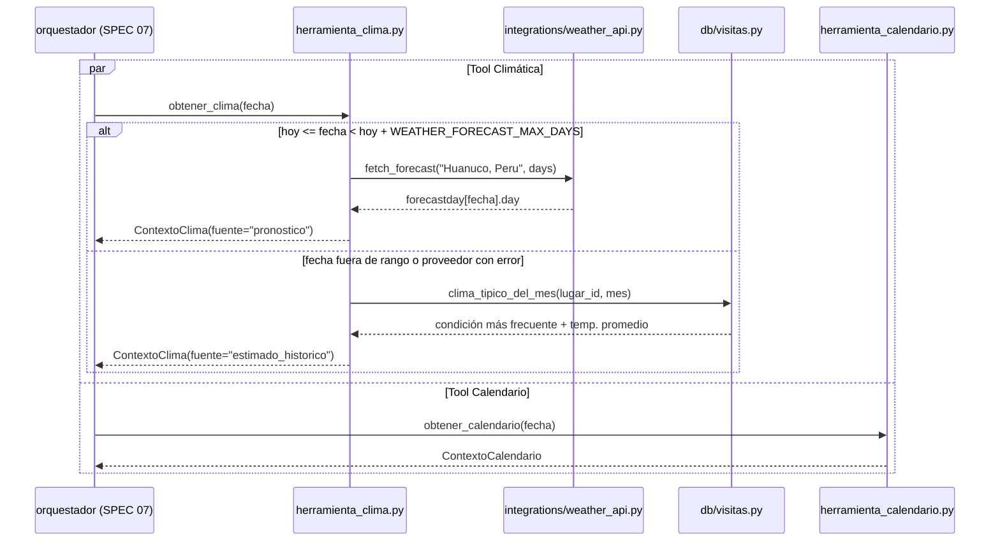

# Especificación Técnica orientada a IA: Herramientas de Contexto (Clima + Calendario)

## 1. Metadatos y Tech Stack

**Objetivo:** Crear las dos herramientas que el orquestador (SPEC 07) ejecuta en paralelo para una fecha.
- **Tool Climática:** devuelve el pronóstico de Huánuco para esa fecha. Si la fecha está fuera del rango de pronóstico, devuelve el clima típico del mes según los históricos.
- **Tool Calendario:** devuelve el día de la semana, si es feriado o fiesta local, y la temporada.

**Backend Stack:** Python 3.11, FastAPI 0.115.6, httpx 0.28.1, SQLAlchemy 2.0.36 (async), Pydantic 2.10.4, pytest 8.3.4. Proveedor: WeatherAPI `forecast.json`. (Contenedor `backend`).

**Frontend Stack:** No aplica.

## 2. Archivos Involucrados (Rutas / Paths)

El Agente tiene permitido leer y modificar ÚNICAMENTE los siguientes archivos:

**Backend:**
- [EDITAR] `backend/app/integrations/weather_api.py` (Añadir `fetch_forecast(location, days)`. **No** modificar `get_current`).
- [EDITAR] `backend/app/core/config.py` (Añadir `WEATHER_FORECAST_MAX_DAYS=3` , `PREDICCION_UBICACION="Huanuco, Peru"` y `PREDICCION_LUGAR_CODIGO="manos-cruzadas"`).
- [NUEVO] `backend/app/models/prediccion.py` (Schemas `ContextoClima` y `ContextoCalendario`. Los SPEC 05 a 07 añaden los suyos aquí).
- [NUEVO] `backend/app/services/prediccion/__init__.py` (Paquete vacío).
- [NUEVO] `backend/app/services/prediccion/herramienta_clima.py` (`obtener_clima(fecha)`).
- [NUEVO] `backend/app/services/prediccion/herramienta_calendario.py` (`obtener_calendario(fecha)`).
- [NUEVO] `backend/app/db/visitas.py` (`clima_tipico_del_mes(session, lugar_id, mes)`, filtrado por Las Manos Cruzadas).
- [LEER] `backend/app/data/calendario_peru.py` (SPEC 03).
- [NUEVO] `backend/tests/test_herramientas_contexto.py`.

## 3. Flujo del Sistema



## 4. Reglas de Negocio (Business Logic)

**Tool Climática:**
- La ubicación del pronóstico sale de `PREDICCION_UBICACION` (Huánuco, donde está Las Manos Cruzadas), nunca del usuario.
- Pronóstico real:
  - Llamar `GET /forecast.json?key=...&q=...&days={N}&lang=es`, con `N = (fecha - hoy).days + 1`, y tomar el `forecastday` cuya `date` coincide con la fecha.
  - Se usa si `0 <= (fecha - hoy).days < WEATHER_FORECAST_MAX_DAYS`, con `hoy` en zona horaria `America/Lima`.
- Mapear `day.condition.code` a las 5 categorías del SPEC 03:
  - `1000` → `Soleado`
  - `1003` → `Parcialmente nublado`
  - `1006, 1009, 1030, 1135, 1147` → `Nublado`
  - `1063, 1150, 1153, 1180, 1183, 1240` → `Lluvia ligera`
  - `1186, 1189, 1192, 1195, 1243, 1246, 1273, 1276` → `Lluvia fuerte`
  - Cualquier otro código → `Nublado`
- `temperatura_max = day.maxtemp_c`.
- **Respaldo histórico:** se usa cuando la fecha está fuera de rango (pasada o lejana) **o** cuando el proveedor falla (red, timeout, 4xx/5xx, JSON inválido). El error del proveedor no se propaga.
  - `condicion_clima` = la condición más frecuente del mes en `visitas_historicas`.
  - `temperatura_max` = su promedio, redondeado a 1 decimal.
- Si tampoco hay históricos para ese mes, lanzar `ContextoNoDisponibleError`.

**Tool Calendario:**
- Es una función pura: no usa red ni DB.
- Usa `calendario_peru.py` (SPEC 03) sin duplicar las listas de feriados.

**Calidad:** Las tools no importan nada de FastAPI (`Request`/`HTTPException`) y la API key nunca aparece en los logs.

## 5. El Contrato (API Contract)

Contrato interno que consume el orquestador (SPEC 07).

**Firmas**

```python
async def obtener_clima(fecha: date, session: AsyncSession, client: WeatherApiClient) -> ContextoClima: ...
def obtener_calendario(fecha: date) -> ContextoCalendario: ...
```

**`ContextoClima`** (Salida de la Tool Climática)

```json
{
  "fecha": "2026-09-27",
  "condicion_clima": "Soleado",
  "temperatura_max": 29.0,
  "fuente": "pronostico"
}
```

`fuente` vale `"pronostico"` (pronóstico real) o `"estimado_historico"` (respaldo).

**`ContextoCalendario`** (Salida de la Tool Calendario)

```json
{
  "fecha": "2026-06-24",
  "dia_semana": "Miércoles",
  "es_feriado": true,
  "nombre_feriado": "Fiesta de San Juan",
  "temporada": "escolar"
}
```

**Respuesta de WeatherAPI consumida** (solo estos campos)

```json
{ "forecast": { "forecastday": [ { "date": "2026-09-27",
  "day": { "maxtemp_c": 29.0, "condition": { "code": 1000, "text": "Soleado" } } } ] } }
```

## 6. Instrucciones de Ejecución para el Agente (Criterios)

1. **`dev-backend`:** Añadir `fetch_forecast` a `WeatherApiClient`, reutilizando el mismo manejo de errores que `get_current`.
2. **`dev-backend`:** Crear `clima_tipico_del_mes` en `db/visitas.py` (WHERE `lugar_id` y mes, GROUP BY `condicion_clima`, ORDER BY `count DESC`).
3. **`dev-backend`:** Crear las dos herramientas y los schemas en `models/prediccion.py`.
4. **`qa`:** Crear `test_herramientas_contexto.py`, con el proveedor mockeado (`httpx.MockTransport`) y la DB mockeada, cubriendo:
   - Fecha dentro del rango → `fuente = "pronostico"`.
   - Fecha lejana → `fuente = "estimado_historico"`.
   - Proveedor con error 503 → respaldo histórico.
   - Mapeo de los códigos `1000`, `1183` y `1195`.
   - `2026-06-24` es fiesta local.
   - `2026-02-10` está en temporada `vacacional`.

**Criterios de aceptación:**
- ✅ Para mañana se usa el pronóstico real de WeatherAPI.
- ✅ Para una fecha dentro de 6 meses se usa el clima típico del mes, sin error.
- ✅ Una caída de WeatherAPI no rompe la predicción: se degrada al respaldo histórico.
- ✅ `GET /api/v1/weather` (SPEC 02) sigue funcionando igual.
