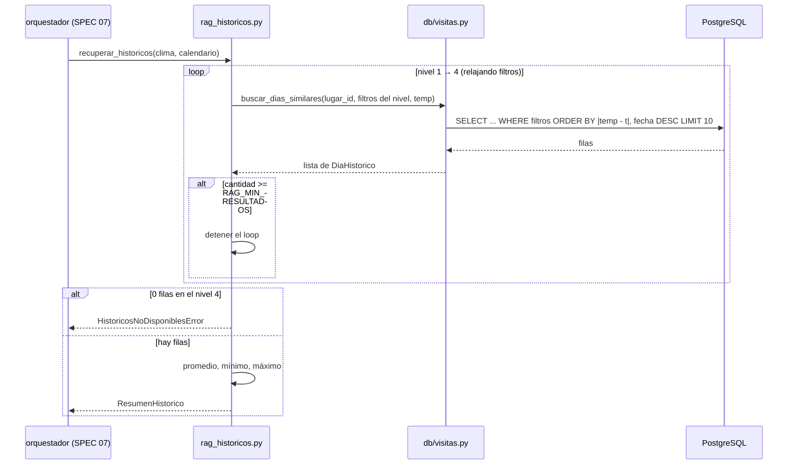

# Especificación Técnica orientada a IA: Recuperación de Históricos (RAG)

## 1. Metadatos y Tech Stack

**Objetivo:** Para Las Manos Cruzadas y con el contexto de clima y calendario de la fecha pedida (SPEC 04), buscar en `visitas_historicas` (SPEC 03) los días pasados más parecidos y resumirlos (promedio, mínimo y máximo). Este resumen es el "conocimiento recuperado" que recibe el LLM (SPEC 06).

**Backend Stack:** Python 3.11, SQLAlchemy 2.0.36 (async) + asyncpg 0.30.0, PostgreSQL 16 (sin pgvector: la similitud se resuelve con filtros SQL), Pydantic 2.10.4, pytest 8.3.4. (Contenedores `backend` y `db`).

**Frontend Stack:** No aplica.

## 2. Archivos Involucrados (Rutas / Paths)

El Agente tiene permitido leer y modificar ÚNICAMENTE los siguientes archivos:

**Backend:**
- [EDITAR] `backend/app/db/visitas.py` (Añadir `buscar_dias_similares(...)`. Solo la query).
- [NUEVO] `backend/app/services/prediccion/rag_historicos.py` (`recuperar_historicos(...)`: niveles de relajación y estadísticas).
- [EDITAR] `backend/app/models/prediccion.py` (Añadir `DiaHistorico` y `ResumenHistorico`).
- [EDITAR] `backend/app/core/exceptions.py` (Añadir `HistoricosNoDisponiblesError`).
- [EDITAR] `backend/app/core/config.py` (Añadir `RAG_MIN_RESULTADOS=5` y `RAG_MAX_RESULTADOS=10`).
- [LEER] `backend/app/services/prediccion/herramienta_clima.py`, `herramienta_calendario.py` (SPEC 04).
- [NUEVO] `backend/tests/test_rag_historicos.py`.

## 3. Flujo del Sistema



## 4. Reglas de Negocio (Business Logic)

**Niveles de coincidencia.** Se detiene en el primer nivel que alcance `RAG_MIN_RESULTADOS`:

| Nivel | Filtros (AND) |
|---|---|
| 1 | `dia_semana` + `condicion_clima` + `es_feriado` + `temporada` |
| 2 | `dia_semana` + `condicion_clima` + `es_feriado` |
| 3 | `dia_semana` + `condicion_clima` |
| 4 | `dia_semana` |

- **Si ningún nivel llega al mínimo:** se usa el nivel 4 con las filas que haya. Solo si hay 0 filas se lanza `HistoricosNoDisponiblesError`.
- **Orden de las filas:** primero la temperatura más cercana (`ABS(temperatura_max - :temp)` ASC) y después las fechas más recientes (`fecha DESC`). Límite: `RAG_MAX_RESULTADOS`.
- **Exclusión:** nunca se incluye la propia fecha consultada (`fecha <> :fecha`), aunque exista en la tabla.

**Estadísticas** (sobre `visitantes_totales` de las filas recuperadas):
- `promedio` = media redondeada a entero.
- `minimo` y `maximo` = valores extremos.

**Resumen en texto:** `resumen_texto` es una frase en español que se pasa al LLM tal cual. Formato:
`"En los últimos {n} {criterios}, el promedio de visitas fue de {promedio} personas, con un mínimo de {minimo} y un pico de {maximo}."`
- Ejemplo de `{criterios}`: `"domingos con clima Soleado"`.

**Seguridad:** Las queries usan `select()` de SQLAlchemy con parámetros; nunca se construye SQL concatenando strings. No se importa nada de FastAPI.

## 5. El Contrato (API Contract)

Contrato interno que consume el orquestador (SPEC 07).

**Firmas**

```python
async def buscar_dias_similares(session: AsyncSession, *, lugar_id: int, fecha_excluida: date, dia_semana: str,
    temperatura: float, condicion_clima: str | None = None, es_feriado: bool | None = None,
    temporada: str | None = None, limite: int = 10) -> list[DiaHistorico]: ...

async def recuperar_historicos(session: AsyncSession, lugar_id: int, clima: ContextoClima,
    calendario: ContextoCalendario) -> ResumenHistorico: ...
```

**`ResumenHistorico`** (Salida)

```json
{
  "nivel_coincidencia": 1,
  "criterios": ["dia_semana", "condicion_clima", "es_feriado", "temporada"],
  "cantidad": 8,
  "promedio": 412,
  "minimo": 380,
  "maximo": 450,
  "resumen_texto": "En los últimos 8 domingos con clima Soleado, el promedio de visitas fue de 412 personas, con un mínimo de 380 y un pico de 450.",
  "dias": [
    { "fecha": "2025-05-18", "dia_semana": "Domingo", "condicion_clima": "Soleado",
      "temperatura_max": 28.0, "es_feriado": false, "temporada": "escolar", "visitantes_totales": 412 }
  ]
}
```

## 6. Instrucciones de Ejecución para el Agente (Criterios)

1. **`dev-backend`:** Añadir `buscar_dias_similares` a `db/visitas.py`. Siempre filtra por `lugar_id`; los filtros que llegan en `None` no se aplican.
2. **`dev-backend`:** Crear `rag_historicos.py` con el loop de niveles, las estadísticas y `resumen_texto`.
3. **`dev-backend`:** Añadir los schemas y la excepción.
4. **`qa`:** Crear `test_rag_historicos.py` con datos controlados en memoria (la query mockeada), cubriendo:
   - Nivel 1 con 8 coincidencias.
   - Caída al nivel 3 cuando no hay coincidencias por temporada.
   - Tabla vacía → `HistoricosNoDisponiblesError`.
   - La fecha consultada queda excluida.
   - Estadísticas correctas.
   - Límite de 10 filas.

**Criterios de aceptación:**
- ✅ Para "domingo soleado, no feriado, escolar" se recuperan entre 5 y 10 domingos soleados con su promedio.
- ✅ Para una combinación rara (por ejemplo, un feriado con lluvia fuerte) se relajan los filtros y aun así se devuelven datos, indicando el `nivel_coincidencia`.
- ✅ `resumen_texto` es legible y coincide con las estadísticas.
