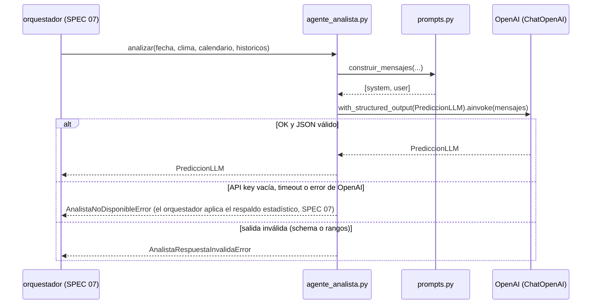

# Especificación Técnica orientada a IA: Agente Analista (LLM OpenAI)

## 1. Metadatos y Tech Stack

**Objetivo:** Con el contexto (SPEC 04) y los históricos recuperados (SPEC 05), pedirle a un LLM de OpenAI que actúe como experto en gestión turística de Las Manos Cruzadas (Kotosh) y devuelva una predicción en JSON validado. El LLM **no** calcula desde cero: evalúa los datos que recibe.

**Backend Stack:** Python 3.11, `langchain-openai` + `openai` (versión exacta fijada en `requirements.txt` al instalar), Pydantic 2.10.4, pytest 8.3.4. (Contenedor `backend`).

**Frontend Stack:** No aplica.

## 2. Archivos Involucrados (Rutas / Paths)

El Agente tiene permitido leer y modificar ÚNICAMENTE los siguientes archivos:

**Backend:**
- [EDITAR] `backend/requirements.txt` (Añadir `langchain-openai` y `openai` con `==`).
- [EDITAR] `backend/app/core/config.py` (Añadir `OPENAI_API_KEY` (SecretStr), `OPENAI_MODEL`, `OPENAI_TIMEOUT_SECONDS=20` y `OPENAI_TEMPERATURE=0.2`).
- [EDITAR] `backend/.env.example` (Nuevas variables, sin valores reales).
- [EDITAR] `backend/app/models/prediccion.py` (Añadir `PrediccionLLM`).
- [EDITAR] `backend/app/core/exceptions.py` (Añadir `AnalistaNoDisponibleError` y `AnalistaRespuestaInvalidaError`).
- [NUEVO] `backend/app/services/prediccion/prompts.py` (System prompt y plantilla del mensaje).
- [NUEVO] `backend/app/services/prediccion/agente_analista.py` (`analizar(...)`).
- [NUEVO] `backend/tests/test_agente_analista.py`.

**Infra:**
- [EDITAR] `docker-compose.yml` y `.env.example` de la raíz (Pasar `OPENAI_*` al servicio `backend`). Responsabilidad de `devops`.

## 3. Flujo del Sistema



## 4. Reglas de Negocio (Business Logic)

**System Prompt** (literal, en `prompts.py`):

```text
Eres un experto en gestión turística del sitio arqueológico de Kotosh (Las Manos Cruzadas), en Huánuco, Perú.
Tu tarea es estimar el número de visitantes para una fecha usando SOLO el contexto y los datos históricos que se te entregan.
Reglas:
- No inventes datos históricos ni eventos que no estén en el contexto.
- Considera el día de la semana, el clima, los feriados/fiestas locales y la temporada (escolar o vacacional).
- Si la fuente del clima es "estimado_historico", indica que la confianza es menor y amplía el rango.
- Si el nivel de coincidencia histórica es 3 o 4, amplía el rango y menciónalo.
- rango_minimo <= prediccion_estimada <= rango_maximo, todos enteros >= 0.
- razonamiento_explicado: máximo 3 oraciones, en español.
```

**Mensaje de usuario** (plantilla):

```text
Contexto actual: El usuario quiere predecir el flujo para el {fecha}. Es {dia_semana}.
El pronóstico es de {temperatura_max}°C y {condicion_clima} (fuente: {fuente}).
Feriado/fiesta: {nombre_feriado | "ninguno"}. Temporada: {temporada}.
Datos históricos recuperados (nivel {nivel_coincidencia}): {resumen_texto}
Instrucción: Analiza estos datos y estima una cifra concreta de visitantes.
```

**Llamada al LLM:**
- `ChatOpenAI(model=OPENAI_MODEL, temperature=OPENAI_TEMPERATURE, timeout=OPENAI_TIMEOUT_SECONDS, max_retries=1)` con `.with_structured_output(PrediccionLLM)`.
- El modelo se define solo por la variable de entorno; nunca va hardcodeado.

**Validación:**
- `PrediccionLLM` exige `0 <= rango_minimo <= prediccion_estimada <= rango_maximo`.
- Si no se cumple → `AnalistaRespuestaInvalidaError`.

**Seguridad:**
- `OPENAI_API_KEY` sale solo de la variable de entorno. Si está vacía → `AnalistaNoDisponibleError`, sin llamar a OpenAI.
- Nunca se loggea la key ni el prompt completo; solo `fecha` y la latencia.

## 5. El Contrato (API Contract)

Contrato interno que consume el orquestador (SPEC 07).

**Firma**

```python
async def analizar(fecha: date, clima: ContextoClima, calendario: ContextoCalendario,
                   historicos: ResumenHistorico, llm: BaseChatModel | None = None) -> PrediccionLLM: ...
```

El parámetro `llm` es inyectable para los tests; si llega `None`, se construye `ChatOpenAI` desde la config.

**`PrediccionLLM`** (Salida estructurada del LLM)

```json
{
  "prediccion_estimada": 420,
  "rango_minimo": 390,
  "rango_maximo": 455,
  "razonamiento_explicado": "Los domingos soleados en temporada escolar promedian 412 visitantes. El buen clima favorece el turismo local desde Huánuco ciudad, por lo que se estima una cifra ligeramente superior al promedio."
}
```

| Campo | Tipo | Regla |
|---|---|---|
| `prediccion_estimada` | int | ≥ 0 |
| `rango_minimo` | int | ≥ 0 y ≤ `prediccion_estimada` |
| `rango_maximo` | int | ≥ `prediccion_estimada` |
| `razonamiento_explicado` | str | 1–1000 caracteres |

## 6. Instrucciones de Ejecución para el Agente (Criterios)

1. **`dev-backend`:** Añadir las dependencias (solo al código; la instalación la decide el usuario), la config y las excepciones.
2. **`dev-backend`:** Crear `prompts.py` con el texto literal del §4 y `agente_analista.py` con la firma del Contrato.
3. **`devops`:** Pasar `OPENAI_API_KEY` y `OPENAI_MODEL` al contenedor `backend` en `docker-compose.yml`.
4. **`qa`:** Crear `test_agente_analista.py` con un LLM falso (`FakeListChatModel` o un stub) que **no** consuma tokens, cubriendo:
   - Respuesta válida.
   - Rango invertido → `AnalistaRespuestaInvalidaError`.
   - Timeout → `AnalistaNoDisponibleError`.
   - Key vacía → no llama al LLM.
   - El mensaje contiene `resumen_texto` y la `fuente`.

**Criterios de aceptación:**
- ✅ Con el contexto de un domingo soleado, la salida es un JSON con los 4 campos y rangos coherentes.
- ✅ Ningún test llama a la API real de OpenAI.
- ✅ La key nunca aparece en los logs ni en las respuestas.
