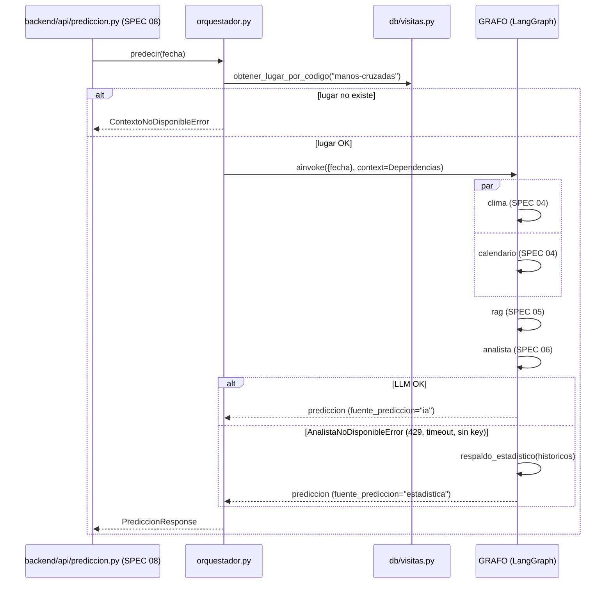

# Especificación Técnica orientada a IA: Orquestador de Predicción (LangGraph)

## 1. Metadatos y Tech Stack

**Objetivo:** Orquestar la predicción de visitantes a Las Manos Cruzadas para una fecha. Un grafo LangGraph ejecuta en paralelo las tools de clima y calendario (SPEC 04), luego el RAG (SPEC 05) y luego el Agente Analista (SPEC 06). Si OpenAI no está disponible, devuelve un **respaldo estadístico** en lugar de fallar. Lo consume el endpoint del SPEC 08.

**Backend Stack:** Python 3.11, FastAPI 0.115.6, langgraph 1.0.5, Pydantic 2.10.4, pytest 8.3.4. (Contenedor `backend`).

**Frontend Stack:** No aplica (ver SPEC 08).

## 2. Archivos Involucrados (Rutas / Paths)

El Agente tiene permitido leer y modificar ÚNICAMENTE los siguientes archivos:

**Backend:**
- [EDITAR] `backend/app/services/prediccion/orquestador.py` (Grafo `StateGraph` + `Orquestador.predecir(fecha)` + respaldo estadístico).
- [EDITAR] `backend/app/models/prediccion.py` (`PrediccionResponse`: añadir `fuente_prediccion` e `historicos.dias`).
- [EDITAR] `backend/app/db/visitas.py` (`obtener_lugar_por_codigo`, sin cambios de firma).
- [EDITAR] `backend/app/main.py` (Silenciar el logger `httpx`, ver §4).
- [EDITAR] `backend/tests/test_orquestador.py`.

## 3. Flujo del Sistema



## 4. Reglas de Negocio (Business Logic)

**Grafo** (se compila una sola vez al importar el módulo):
- Estado `TypedDict` con: `fecha`, `clima`, `calendario`, `historicos`, `prediccion`, `fuente_prediccion`.
- Aristas: `START → clima`, `START → calendario`, `["clima", "calendario"] → rag`, `rag → analista → END`.
- Cada nodo devuelve solo su clave del estado.
- Las dependencias (session, weather_client, lugar_id, settings, llm) viajan en el `context` de LangGraph, no en el estado.

**Respaldo estadístico** (lo aplica el nodo `analista` cuando captura `AnalistaNoDisponibleError`):
- `prediccion_estimada = historicos.promedio`, `rango_minimo = historicos.minimo`, `rango_maximo = historicos.maximo`.
- `razonamiento_explicado` = `"Estimación estadística basada en {cantidad} días similares (el análisis con IA no está disponible)."`
- `fuente_prediccion = "estadistica"`. Con respuesta del LLM → `"ia"`.
- `AnalistaRespuestaInvalidaError` **no** activa el respaldo: se propaga (502 en SPEC 08).
- Se loggea `WARNING` con `fecha` y el nombre de la excepción, nunca la key.

**Errores que se propagan sin traducir:** `ContextoNoDisponibleError`, `HistoricosNoDisponiblesError`, `AnalistaRespuestaInvalidaError`.

**Seguridad de logs:** en `main.py`, `logging.getLogger("httpx").setLevel(logging.WARNING)`. Motivo: en nivel INFO, httpx escribe la URL completa, que incluye `?key=` de WeatherAPI.

## 5. El Contrato (API Contract)

Contrato interno que consume el endpoint del SPEC 08.

**Firma**

```python
class Orquestador:
    def __init__(self, session, weather_client, llm=None, settings=None): ...
    async def predecir(self, fecha: date) -> PrediccionResponse: ...
```

**`PrediccionResponse`** (Salida; es el mismo JSON que la respuesta 200 del SPEC 08)

```json
{
  "fecha": "2026-09-27", "lugar": "Las Manos Cruzadas",
  "contexto": { "dia_semana": "Domingo", "condicion_clima": "Soleado", "temperatura_max": 29.0,
    "fuente_clima": "pronostico", "es_feriado": false, "nombre_feriado": null, "temporada": "escolar" },
  "historicos": { "cantidad": 8, "promedio": 412, "minimo": 380, "maximo": 450, "nivel_coincidencia": 1,
    "dias": [ { "fecha": "2025-05-18", "visitantes_totales": 412, "condicion_clima": "Soleado" } ] },
  "prediccion_estimada": 420, "rango_minimo": 390, "rango_maximo": 455,
  "fuente_prediccion": "ia",
  "razonamiento_explicado": "Los domingos soleados promedian 412 visitantes; se estima una cifra algo mayor."
}
```

| Campo nuevo | Tipo | Regla |
|---|---|---|
| `fuente_prediccion` | `"ia" \| "estadistica"` | `"estadistica"` solo cuando se usa el respaldo |
| `historicos.dias[]` | lista | Días recuperados por el RAG, ordenados por `fecha` ASC. Solo `fecha`, `visitantes_totales` y `condicion_clima` |

## 6. Instrucciones de Ejecución para el Agente (Criterios)

1. **`dev-backend`:** Añadir al nodo `analista` el respaldo estadístico y el campo `fuente_prediccion`.
2. **`dev-backend`:** Añadir `historicos.dias` a `PrediccionResponse`, mapeando desde `ResumenHistorico.dias`.
3. **`dev-backend`:** Silenciar el logger `httpx` en `main.py`.
4. **`qa`:** Actualizar `test_orquestador.py` con estos casos:
   - Si `analizar` lanza `AnalistaNoDisponibleError`, la respuesta usa el promedio, el mínimo y el máximo, y `fuente_prediccion="estadistica"`.
   - Si `AnalistaRespuestaInvalidaError`, se propaga.
   - Si el LLM responde bien, `fuente_prediccion="ia"`.
   - `historicos.dias` va ordenado por fecha y tiene solo los 3 campos.
   - El logger `httpx` queda en WARNING.

**Criterios de aceptación:**
- ✅ Con OpenAI respondiendo 429, `POST /api/v1/predicciones` devuelve 200 con `fuente_prediccion="estadistica"` en lugar de 503.
- ✅ La key de WeatherAPI ya no aparece en los logs del backend.
- ✅ Todos los tests pasan sin llamar a OpenAI ni a WeatherAPI reales.
