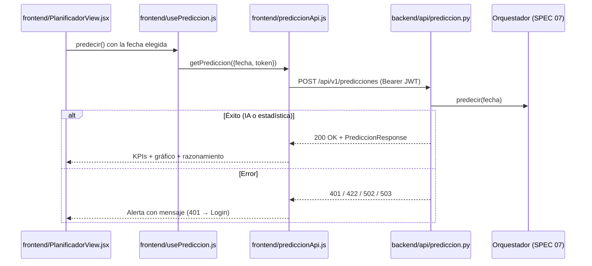

# Especificación Técnica orientada a IA: Planificador de Visitas (Endpoint + Dashboard)

## 1. Metadatos y Tech Stack

**Objetivo:** Dar al usuario autenticado un dashboard, el **Planificador de Visitas**, para estimar la afluencia a Las Manos Cruzadas en cualquier fecha: indicadores (KPIs), contexto, gráfico de días similares y razonamiento. Tras el login es la **única** pantalla: la vista "Clima" se retira de la UI, aunque el endpoint del SPEC 02 queda en el backend.

**Backend Stack:** Python 3.11, FastAPI 0.115.6, Pydantic 2.10.4, pytest 8.3.4. (Contenedor `backend`).

**Frontend Stack:** React 18.3.1, JavaScript (JSX), Vite 5.4, TailwindCSS 3.4 (colores `var(--color-*)` del tema), Fetch API, Vitest 2.1.9. **Sin librerías de gráficos**: el gráfico es SVG propio. (Contenedor `frontend`).

## 2. Archivos Involucrados (Rutas / Paths)

El Agente tiene permitido leer y modificar ÚNICAMENTE los siguientes archivos:

**Backend:**
- [EDITAR] `backend/app/api/prediccion.py` (Router `POST /api/v1/predicciones`; loggear `WARNING` con el tipo de error antes de responder 502/503).
- [EDITAR] `backend/tests/test_prediccion_endpoint.py`.

**Frontend:**
- [NUEVO] `frontend/src/components/layout/DashboardLayout.jsx` (Sidebar + cabecera + área principal; responsive).
- [NUEVO] `frontend/src/components/layout/Sidebar.jsx` (Marca, lugar, usuario, `ThemeToggle`, `Cerrar sesión`).
- [NUEVO] `frontend/src/components/planificador/PlanificadorContainer.jsx` (Container: usa `usePrediccion`).
- [NUEVO] `frontend/src/components/planificador/PlanificadorView.jsx`, `FormularioFecha.jsx`, `KpiCard.jsx`, `HistoricosChart.jsx`, `RazonamientoCard.jsx` (Presentacionales).
- [EDITAR] `frontend/src/api/prediccionApi.js`, `frontend/src/hooks/usePrediccion.js` (Validar `fuente_prediccion` e `historicos.dias`).
- [EDITAR] `frontend/src/components/LoginContainer.jsx`, `frontend/src/App.jsx`, `frontend/index.html` (Título `Planificador de Visitas`).
- [ELIMINAR] `AppShell.jsx`, `PrediccionContainer.jsx`, `PrediccionView.jsx`, `WeatherContainer.jsx`, `WeatherView.jsx`, `hooks/useWeather.js`, `api/weatherApi.js`, `data/cities.js` y `tests/cities.test.js`.
- [EDITAR/NUEVO] `frontend/tests/` (Actualizar `LoginContainer.test.jsx` y `errorMapping.test.jsx`; nuevos `Planificador.test.jsx` y `prediccionApi.test.js`).

## 3. Flujo del Sistema



## 4. Reglas de Negocio (Business Logic)

**Layout** (DashboardLayout):
- Desktop: sidebar fija a la izquierda (`w-64`). Móvil (< `md`): barra superior con botón de menú que abre el sidebar.
- Sidebar: marca `Planificador de Visitas`, subtítulo `Las Manos Cruzadas · Kotosh`, correo del usuario, `ThemeToggle` y botón `Cerrar sesión`.
- Cabecera del área principal: título `Planificador de Visitas` y subtítulo `Estimá la afluencia de visitantes para organizar personal y recursos.`

**Formulario:** label `Fecha` con `input type="date"` y botón `Estimar afluencia`, deshabilitado si no hay fecha o está cargando. Mientras carga se muestra un skeleton de las tarjetas con `role="status"` y el texto `Analizando…`.

**KPIs** (4 tarjetas en grid de 1/2/4 columnas):
1. `Visitantes estimados`: `≈ {prediccion_estimada}`.
2. `Rango esperado`: `{rango_minimo} – {rango_maximo}`.
3. `Clima`: `{condicion_clima} · {temperatura_max}°C`. Si `fuente_clima="estimado_historico"`, badge `Estimado`.
4. `Día`: `{dia_semana}`, con `nombre_feriado` o `Temporada {temporada}`.

**Gráfico** (`HistoricosChart`, SVG, `role="img"` con `aria-label`):
- Una barra por cada `historicos.dias[]`, con la altura proporcional a `visitantes_totales`.
- Eje X: fecha `dd/mm/aa`. Tooltip con `<title>`: fecha, visitantes y clima.
- Línea horizontal punteada con la `prediccion_estimada` y la leyenda `Predicción`.
- Título `Días similares ({cantidad})` y nota `Nivel de coincidencia {nivel_coincidencia} de 4`.
- Si la lista está vacía, mostrar `Sin días similares para graficar.`

**Razonamiento** (`RazonamientoCard`): muestra `razonamiento_explicado` con un badge `Análisis IA` (si `fuente_prediccion="ia"`) o `Estimación estadística` (si `"estadistica"`).

**Estilo:** solo Tailwind con los tokens del tema (`bg-surface`, `border-border`, `text-text-muted`, `bg-primary`…). Tarjetas `rounded-2xl` con borde y sombra suave. Debe funcionar en tema claro y oscuro.

**Errores** (`role="alert"` + botón `Reintentar`; el 401 llama a `expireSession` del SPEC 01):

| Caso | Mensaje |
|---|---|
| 401 | `Tu sesión expiró. Iniciá sesión nuevamente.` |
| 422 | `Ingresá una fecha válida.` |
| 502 | `El análisis devolvió un resultado inválido. Intentá de nuevo.` |
| 503 | `El servicio de predicción no está disponible temporalmente.` |
| Red / otro | `No se pudo obtener la predicción. Intentá de nuevo.` |

## 5. El Contrato (API Contract)

El Agente debe respetar estrictamente esta estructura para la comunicación.

**Ruta:** `POST /api/v1/predicciones`
**Headers:** `Authorization: Bearer <token_jwt>` · `Content-Type: application/json`

**Request** (Enviado por `prediccionApi.js`)

```json
{ "fecha": "2026-09-27" }
```

**Response HTTP 200:** el JSON de `PrediccionResponse` del SPEC 07 §5, incluidos `fuente_prediccion` e `historicos.dias`.

**Response HTTP 401 / 422 / 502 / 503** (Errores)

| Código | Body |
|---|---|
| 401 | `{"detail": "No autenticado."}` + header `WWW-Authenticate: Bearer` |
| 422 | Formato estándar de FastAPI (`detail` es una lista) |
| 502 | `{"detail": "El analista devolvió una respuesta inválida."}` |
| 503 | `{"detail": "Servicio de predicción no disponible."}` (sin lugar o sin históricos) |

## 6. Instrucciones de Ejecución para el Agente (Criterios)

1. **`dev-backend`:** Añadir en `prediccion.py` el log `WARNING` con la clase del error y la fecha (sin key ni prompt).
2. **`frontend`:** Crear el layout y los componentes del Planificador, conectar `LoginContainer` → `DashboardLayout` + `PlanificadorContainer` y eliminar los archivos de Clima.
3. **`qa`:** Actualizar los tests existentes y crear `Planificador.test.jsx` con estos casos:
   - Login → dashboard.
   - Éxito con 4 KPIs.
   - Gráfico con N barras.
   - Badge `Estimación estadística`.
   - Badge `Estimado` del clima.
   - 401 → Login.
   - 503 → alerta.
   - `Cerrar sesión`.
4. **`qa`:** Añadir al test del endpoint el caso `fuente_prediccion="estadistica"` en la respuesta 200.

**Criterios de aceptación:**
- ✅ Tras el login se ve solo el Planificador de Visitas, sin la pestaña Clima.
- ✅ Al estimar una fecha se ven los KPIs, el gráfico de días similares y el razonamiento con su badge.
- ✅ Se ve bien en móvil y escritorio, en tema claro y oscuro.
- ✅ Todos los tests de `frontend/` y `backend/` pasan.
