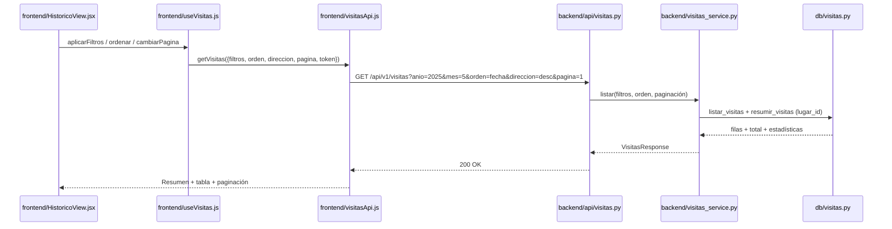

# Especificación Técnica orientada a IA: Histórico de Visitas (Consulta + Filtros)

## 1. Metadatos y Tech Stack

**Objetivo:** Que el usuario autenticado consulte los datos históricos de Las Manos Cruzadas (SPEC 03) en una tabla ordenable, con filtros por **fecha exacta**, **mes** (de un año) o **año**, paginación y un resumen del periodo filtrado. Es una sección nueva del dashboard (SPEC 08).

**Backend Stack:** Python 3.11, FastAPI 0.115.6, SQLAlchemy 2.0.36 (async), Pydantic 2.10.4, pytest 8.3.4. (Contenedor `backend`).

**Frontend Stack:** React 18.3.1, JavaScript (JSX), TailwindCSS 3.4 (tokens del tema), Fetch API, Vitest 2.1.9. Sin librerías de tablas ni de routing. (Contenedor `frontend`).

## 2. Archivos Involucrados (Rutas / Paths)

El Agente tiene permitido leer y modificar ÚNICAMENTE los siguientes archivos:

**Backend:**
- [NUEVO] `backend/app/api/visitas.py` (Router `GET /api/v1/visitas`, sin lógica).
- [NUEVO] `backend/app/services/visitas_service.py` (Valida la combinación de filtros, resuelve el lugar y arma la respuesta).
- [NUEVO] `backend/app/models/visitas.py` (`VisitaItem`, `ResumenVisitas`, `VisitasResponse`).
- [EDITAR] `backend/app/db/visitas.py` (Añadir `listar_visitas(...)` y `resumir_visitas(...)`).
- [EDITAR] `backend/app/api/dependencies.py` (`get_visitas_service`), `backend/app/main.py` (Registrar el router).
- [NUEVO] `backend/tests/test_visitas_endpoint.py`, `backend/tests/test_visitas_service.py`.

**Frontend:**
- [EDITAR] `frontend/src/components/layout/Sidebar.jsx`, `DashboardLayout.jsx`, `LoginContainer.jsx` (Navegación `Planificador` / `Histórico`).
- [NUEVO] `frontend/src/api/visitasApi.js`, `frontend/src/hooks/useVisitas.js`.
- [NUEVO] `frontend/src/components/historico/HistoricoContainer.jsx`, `HistoricoView.jsx`, `FiltrosHistorico.jsx`, `TablaVisitas.jsx`, `Paginacion.jsx`.
- [NUEVO] `frontend/tests/Historico.test.jsx`, `frontend/tests/visitasApi.test.js`.

## 3. Flujo del Sistema



## 4. Reglas de Negocio (Business Logic)

**Filtros (Backend)**. Hay que usar exactamente uno de estos modos:
- Sin filtros: todos los registros.
- `fecha=YYYY-MM-DD`: un solo día.
- `anio=YYYY` (2000–2100): el año completo.
- `anio` + `mes` (1–12): un mes de ese año.

**Combinaciones inválidas** (responden 422 con `detail` string):
- `fecha` junto con `anio` o `mes` → `Usá fecha, o año (con mes opcional), no ambos.`
- `mes` sin `anio` → `El mes requiere un año.`

**Orden:**
- `orden` ∈ `fecha | visitantes` (por defecto `fecha`).
- `direccion` ∈ `asc | desc` (por defecto `desc`).
- Desempate estable por `fecha DESC`.

**Paginación:**
- `pagina` ≥ 1 (por defecto 1). `tamano` entre 1 y 100 (por defecto 31).
- `total_paginas = ceil(total / tamano)`.
- Una página mayor que la última devuelve `items: []`.

**Resumen del periodo filtrado** (se calcula sobre **todas** las filas del filtro, no solo la página):
- `promedio` (entero, redondeo half-up), `minimo`, `maximo` y `total_visitantes`.
- Si no hay filas → `resumen: null`.

**Seguridad y datos:**
- Requiere JWT (`require_authenticated_user`, igual que el SPEC 08).
- Siempre se filtra por el lugar `manos-cruzadas`. Si no existe → 503 `Histórico no disponible.`
- Queries con `select()` parametrizado. El orden se elige desde una lista blanca, nunca interpolando strings.

**UI:**
- El sidebar tiene la navegación `Planificador` / `Histórico`, con el ítem activo marcado con `aria-current="page"`.
- `FiltrosHistorico`:
  - Select `Filtrar por` con las opciones `Todo`, `Fecha`, `Mes` y `Año`.
  - Según la opción aparece `input type="date"`, `input type="month"` o `input type="number"` (año).
  - Botones `Aplicar filtros` y `Limpiar`.
- Resumen: 4 `KpiCard` (SPEC 08) con `Días`, `Promedio`, `Mínimo` y `Máximo`.
- `TablaVisitas`:
  - Columnas: `Fecha` (dd/mm/aaaa), `Día`, `Clima`, `Temp. máx.`, `Feriado` (`Sí` / `—`), `Temporada` y `Visitantes`.
  - Las cabeceras `Fecha` y `Visitantes` son botones que alternan asc/desc y exponen `aria-sort`.
  - En móvil la tabla tiene scroll horizontal.
- `Paginacion`: botones `Anterior` y `Siguiente` (se deshabilitan en los extremos) y el texto `Página {p} de {n} · {total} registros`.
- Al entrar a la sección se carga la vista por defecto: `Todo`, `fecha desc`, página 1.
- Mientras carga: `Cargando histórico…` con `role="status"`.

| Caso UI | Mensaje |
|---|---|
| Sin resultados | `No hay registros para los filtros seleccionados.` |
| 401 | `Tu sesión expiró. Iniciá sesión nuevamente.` (llama a `expireSession`) |
| 422 | `Revisá los filtros seleccionados.` |
| 503 | `El histórico no está disponible temporalmente.` |
| Red / otro | `No se pudo cargar el histórico. Intentá de nuevo.` |

## 5. El Contrato (API Contract)

El Agente debe respetar estrictamente esta estructura para la comunicación.

**Ruta:** `GET /api/v1/visitas?fecha=&anio=&mes=&orden=fecha&direccion=desc&pagina=1&tamano=31`
**Headers:** `Authorization: Bearer <token_jwt>`. Los parámetros vacíos no se envían.

**Response HTTP 200** (Éxito)

```json
{
  "lugar": "Las Manos Cruzadas",
  "filtros": { "fecha": null, "anio": 2025, "mes": 5 },
  "orden": "fecha", "direccion": "desc", "pagina": 1, "tamano": 31, "total": 31, "total_paginas": 1,
  "resumen": { "promedio": 205, "minimo": 41, "maximo": 512, "total_visitantes": 6355 },
  "items": [
    { "fecha": "2025-05-31", "dia_semana": "Sábado", "condicion_clima": "Soleado", "temperatura_max": 27.4,
      "es_feriado": false, "temporada": "escolar", "visitantes_totales": 243 }
  ]
}
```

**Response HTTP 401 / 422 / 503** (Errores)

| Código | Body |
|---|---|
| 401 | `{"detail": "No autenticado."}` + header `WWW-Authenticate: Bearer` |
| 422 | Combinación inválida: `{"detail": "<mensaje de §4>"}`. Tipo o rango inválido: formato estándar de FastAPI |
| 503 | `{"detail": "Histórico no disponible."}` |

## 6. Instrucciones de Ejecución para el Agente (Criterios)

1. **`dev-backend`:** Crear el router, el service, los modelos y las queries cumpliendo el Contrato y la lista blanca de orden.
2. **`frontend`:**
   - Añadir la navegación al sidebar.
   - Crear la sección Histórico reutilizando `KpiCard`.
   - Crear `visitasApi.js` sin hardcodear la URL.
3. **`qa`:**
   - Backend: cada modo de filtro, combinaciones inválidas (422), orden por visitantes asc/desc, paginación y página fuera de rango, resumen sobre el total, 401 y lugar inexistente (503).
   - Frontend: navegación, filtros por mes y por año construyen la URL correcta, ordenar al pulsar la cabecera, paginación, estado vacío y 401 → Login.

**Criterios de aceptación:**
- ✅ Desde el sidebar entro a `Histórico` y veo los registros ordenados por fecha descendente.
- ✅ Puedo filtrar por una fecha, por un mes de un año o por un año, y el resumen refleja solo ese periodo.
- ✅ Puedo ordenar por fecha o por visitantes y navegar entre páginas.
- ✅ Todos los tests pasan.
